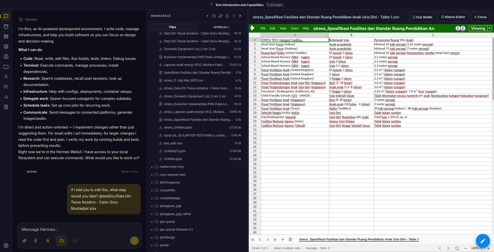
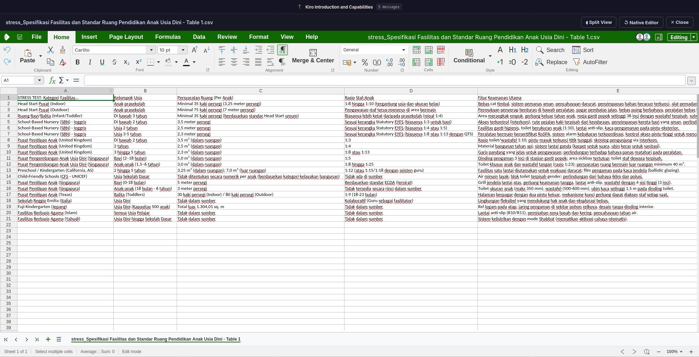

# Hermes Collabora Extension

A powerful extension that brings the **Collabora Online Development Edition (CODE)** directly into your Hermes WebUI. This allows you to seamlessly view and edit Office documents (`.docx`, `.xlsx`, `.pptx`) and `.csv` files natively within your workspace.



## Features

- **Native File Interception:** Automatically intercepts clicks on supported files and opens them in a dedicated preview pane instead of downloading them.
- **Resizable Workspace:** Features a custom drag handle to dynamically resize the document editor against your chat workspace.
- **Full Width Mode:** A toggleable full-width mode that instantly hides the chat and file explorer for a distraction-free editing experience.
- **Native Editor Fallback:** A dedicated button to seamlessly switch back to the Hermes WebUI's built-in text editor (perfect for raw CSV editing).
- **WOPI Integration:** Includes a custom Python WOPI backend that bridges the Hermes Docker workspace with the Collabora container for secure file access.



## Prerequisites

- Docker and Docker Compose
- Hermes WebUI installed and running
- Access to your `~/.hermes/extensions` directory

## Installation

### 1. Set up the Backend Services

This extension requires a Collabora CODE server and a WOPI server bridge. We've provided a self-contained Docker Compose file to spin both up.

1. Ensure the `wopi_server.py` and `docker-compose.collabora.yml` files are in your Hermes project root (e.g., `/home/abuhafi/Project/hermesDIL`).
2. Start the backend services:

```bash
docker compose -f docker-compose.collabora.yml up -d
```

This will start:
- `collabora`: The Collabora CODE server (running on port `9980`)
- `wopi-server`: The Python bridge server (running on port `8880` internally)

### 2. Install the WebUI Extension

The frontend logic is contained in a single JavaScript extension file.

1. Copy the `collabora-viewer.js` file into your Hermes extensions directory:
   ```bash
   cp collabora-viewer.js ~/.hermes/extensions/
   ```
2. Reload your Hermes WebUI tab in the browser.

## Usage

1. Open your Hermes WebUI.
2. Navigate to your file explorer.
3. Click on any `.docx`, `.xlsx`, `.pptx`, or `.csv` file.
4. The Collabora viewer will automatically open on the right side of your screen!

### Controls

- **Resize:** Hover over the left edge of the preview pane and drag horizontally.
- **Full Width:** Click the `⛶ Full Width` button in the header bar to maximize the document. Click `◧ Split View` to restore.
- **Native Editor:** Click `↺ Native Editor` to bypass Collabora and open the file using Hermes's default text viewer (useful for raw CSV edits).
- **Close:** Click `✕ Close` to dismiss the preview pane.

## AI Installation Prompt

Want to install this extension automatically? Just copy and paste this prompt into your Hermes chat and let your AI agent do the heavy lifting:

> "@Hermes, please install the Hermes Collabora Extension for me. Download `docker-compose.collabora.yml` and `wopi_server.py` from this repository into my current project root. Then, copy `collabora-viewer.js` to my `~/.hermes/extensions/` directory. Once the files are in place, spin up the backend by running `docker compose -f docker-compose.collabora.yml up -d`. Let me know when it's done so I can reload the page!"

## Architecture

- **Collabora CODE Container:** Runs the LibreOffice-based web document editor.
- **WOPI Server (Python):** Implements the Web Application Open Platform Interface (WOPI) protocol. It translates Collabora's REST API requests (`CheckFileInfo`, `GetFile`, `PutFile`) into local file system operations within the Docker workspace.
- **Hermes Extension (JS):** Monkey-patches `window.downloadFile` and `window.openFile` in the Hermes WebUI to intercept supported extensions and inject an `iframe` pointing to the Collabora viewer.
